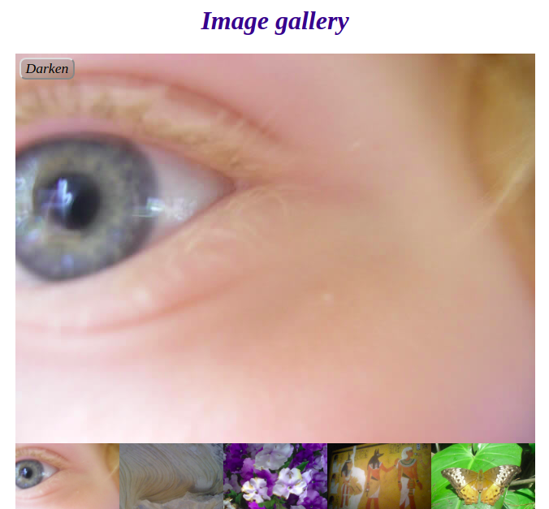

# Image gallery

## This project is part of the [gomycode](https://gomycode.tn) fullstack JS cursus.

## User Stories

1. <strong>User Story:</strong> The user can change the big displayed image on the screen by clicking on any of the other thumbnails beneath the big image.

2. <strong>User Story:</strong> The user can modify the image's lightness by darkening or lengthening it by clicking on the button in the upper-left of the big image.

## The objective of this project is to test one's comprehension of basic to intermediate JS loops, functions, conditionals and events.

	

# What did I learn:

1. Basic JS tasks: loops, functions, conditionals...

2. DOM manipulation.
